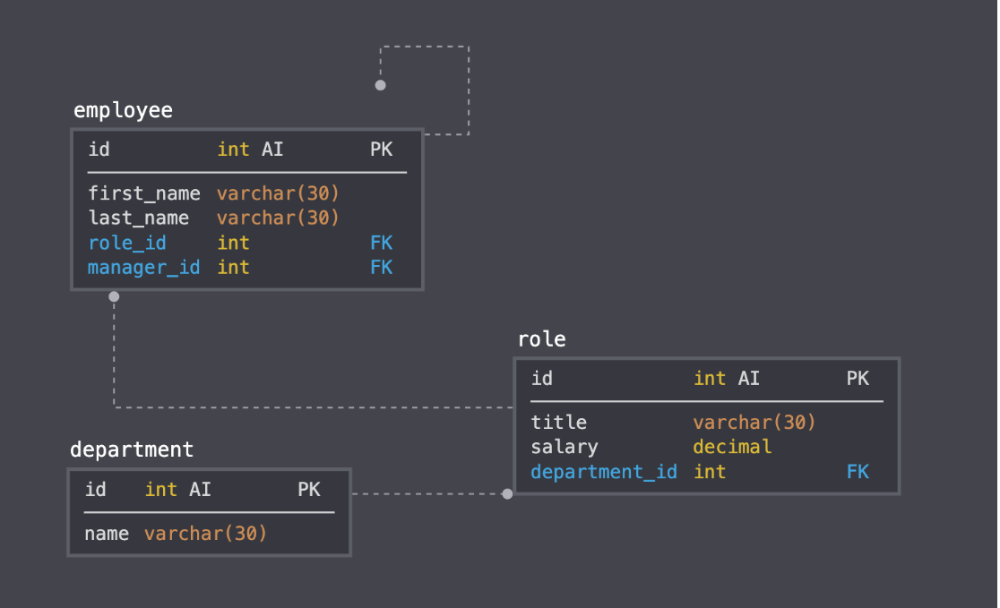

# Employee-Nguyen-Tracker
MySQL-Employee-Tracker is an interface command program that make it easy for non-developers to view and interact with information stored in databases. This interface is a good example of a Content Management Systems; a command line application for managing a company's employees using node, inquirer, and MySQL.

<h2> USER STORY <h2>
As a business owner I want to be able to view and manage the departments, roles, and employees in my company So that I can organize and plan my business

<h2> Database Design <h2>

<h2> Author <h2>
William Nguyen

<h2> License <h2>
The MIT license